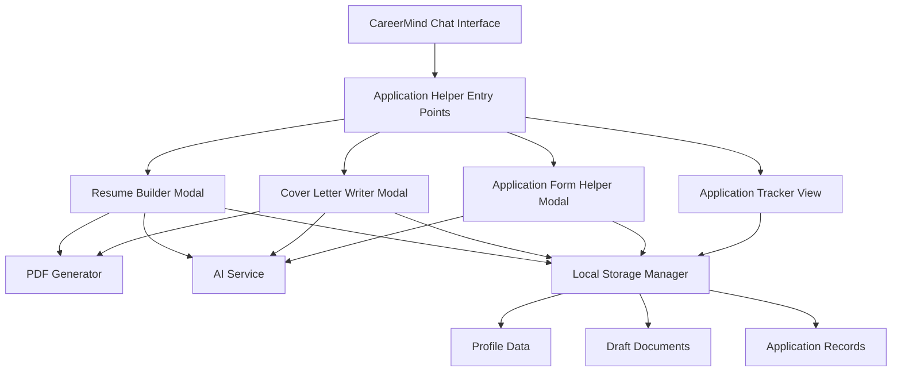
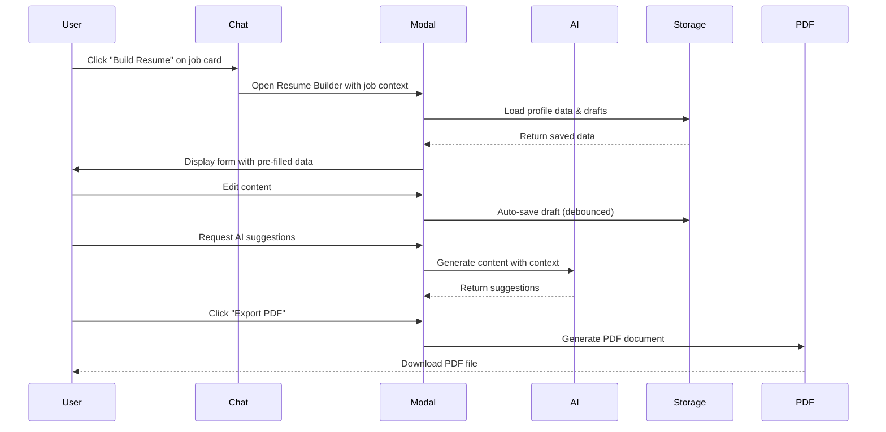

# Design Document: Application Helper System

## Overview

The Application Helper System is a comprehensive feature that extends CareerMind AI with tools for creating, managing, and tracking job and internship applications. The system integrates seamlessly with the existing chat-based career guidance interface while providing dedicated workflows for resume building, cover letter writing, application form assistance, and application tracking.

### Design Philosophy

The Application Helper maintains CareerMind AI's core design principles:
- **Minimal and Frictionless**: Clean interfaces inspired by ChatGPT/Claude with no unnecessary chrome
- **AI-First**: Intelligent assistance throughout the application process
- **Age-Appropriate**: Language, examples, and guidance tailored for ages 12-18
- **Professional Output**: Industry-standard documents that work with Applicant Tracking Systems (ATS)

### Key Design Decisions

1. **Modal-Based Workflows**: Application creation happens in focused modal dialogs launched from the chat interface, maintaining context while providing dedicated workspace
2. **PDF Generation**: Using [@react-pdf/renderer](https://react-pdf.org/) for client-side PDF generation with full control over formatting and ATS compatibility
3. **Local-First Storage**: All data persists to localStorage with automatic save, ensuring no data loss and offline capability
4. **Groq AI Integration**: Leveraging the existing Groq API integration for content generation with context-aware prompts
5. **Component Reuse**: Extending existing UI components and patterns from the career guidance system

## Architecture

### System Components



### Integration Points

1. **Chat Interface Integration**
   - New action buttons in job card components: "Build Resume", "Write Cover Letter", "Apply"
   - Chat commands trigger application helper modals with context
   - Application tracker accessible from main navigation

2. **AI Service Integration**
   - Extends existing `src/lib/ai-service.ts` with application-specific prompts
   - Context-aware generation using user profile, job descriptions, and conversation history
   - Fallback to template-based generation if AI service unavailable

3. **Storage Integration**
   - Extends existing localStorage patterns from conversation management
   - Separate storage keys for profile, drafts, and applications
   - Automatic save with debounce (2 seconds)

### Data Flow



## Components and Interfaces

### 1. Resume Builder Component

**Component**: `ApplicationBuilderModal.tsx` (extend existing)

**Props**:
```typescript
interface ResumeBuilderProps {
  isOpen: boolean;
  onClose: () => void;
  job?: JobCard;  // Optional job context
  draftId?: string;  // Load existing draft
  profileData?: ProfileData;
}
```

**State Management**:
```typescript
interface ResumeState {
  template: 'modern' | 'classic' | 'minimal';
  colorScheme: 'blue' | 'orange' | 'neutral';
  fontPairing: 'professional' | 'modern';
  sections: ResumeSection[];
  metadata: {
    draftId: string;
    lastSaved: Date;
    name: string;
  };
}

interface ResumeSection {
  id: string;
  type: 'personal' | 'education' | 'experience' | 'skills' | 'achievements' | 'custom';
  title: string;
  content: any;  // Type varies by section
  order: number;
  visible: boolean;
}
```

**Key Features**:
- Template selector with live preview
- Drag-and-drop section reordering
- Inline editing with rich text support
- AI suggestion button per section
- Real-time preview pane
- Export to PDF button

### 2. Cover Letter Writer Component

**Component**: `CoverLetterWriterModal.tsx` (new)

**Props**:
```typescript
interface CoverLetterWriterProps {
  isOpen: boolean;
  onClose: () => void;
  job?: JobCard;
  draftId?: string;
  profileData?: ProfileData;
}
```

**State Management**:
```typescript
interface CoverLetterState {
  jobTitle: string;
  companyName: string;
  jobDescription: string;
  tone: 'professional' | 'enthusiastic' | 'formal';
  content: {
    opening: string;
    body: string[];  // Array of paragraphs
    closing: string;
  };
  metadata: {
    draftId: string;
    lastSaved: Date;
    name: string;
  };
}
```

**Key Features**:
- Job details input form
- Tone selector with regeneration
- Paragraph-level editing
- AI generation and regeneration
- Preview pane with business letter formatting
- Export to PDF button

### 3. Application Form Helper Component

**Component**: `ApplicationFormHelperModal.tsx` (new)

**Props**:
```typescript
interface ApplicationFormHelperProps {
  isOpen: boolean;
  onClose: () => void;
  job?: JobCard;
}
```

**State Management**:
```typescript
interface FormHelperState {
  questions: FormQuestion[];
  customQuestions: FormQuestion[];
  selectedQuestion: string | null;
}

interface FormQuestion {
  id: string;
  question: string;
  category: 'motivation' | 'strengths' | 'experience' | 'goals' | 'custom';
  savedResponse: string;
  characterLimit?: number;
  lastModified: Date;
}
```

**Key Features**:
- Library of 15+ common questions
- Search and filter questions
- Response editor with character counter
- AI suggestion generation
- Copy to clipboard functionality
- Custom question management

### 4. Application Tracker Component

**Component**: `ApplicationTrackerView.tsx` (new)

**Props**:
```typescript
interface ApplicationTrackerProps {
  // Standalone view, no props needed
}
```

**State Management**:
```typescript
interface TrackerState {
  applications: Application[];
  filter: ApplicationStatus | 'all';
  sortBy: 'date' | 'company' | 'status';
  sortOrder: 'asc' | 'desc';
}

interface Application {
  id: string;
  jobTitle: string;
  companyName: string;
  applicationDate: Date;
  status: 'applied' | 'interview' | 'rejected' | 'accepted';
  followUpDate?: Date;
  notes: string;
  attachments: {
    resumeId?: string;
    coverLetterId?: string;
  };
}
```

**Key Features**:
- Sortable table view
- Status filter chips
- Status update dropdown
- Follow-up date picker
- Notes editor
- Statistics dashboard
- Timeline view

### 5. Profile Manager Component

**Component**: `ProfileManagerModal.tsx` (new)

**Props**:
```typescript
interface ProfileManagerProps {
  isOpen: boolean;
  onClose: () => void;
}
```

**State Management**:
```typescript
interface ProfileData {
  personal: {
    fullName: string;
    email: string;
    phone: string;
    location: string;
    linkedIn?: string;
    portfolio?: string;
  };
  education: EducationEntry[];
  experience: ExperienceEntry[];
  skills: string[];
  achievements: string[];
}

interface EducationEntry {
  id: string;
  schoolName: string;
  degree: string;
  fieldOfStudy: string;
  startDate: string;
  endDate: string;
  current: boolean;
  achievements: string[];
}

interface ExperienceEntry {
  id: string;
  organizationName: string;
  role: string;
  startDate: string;
  endDate: string;
  current: boolean;
  responsibilities: string[];
}
```

**Key Features**:
- Multi-section form
- Add/remove/edit entries
- Validation for required fields
- Save and cancel actions
- Data used across all application tools

### 6. PDF Generator Service

**Service**: `src/lib/pdf-generator.ts` (new)

**Key Functions**:
```typescript
interface PDFGeneratorService {
  generateResumePDF(resume: ResumeState): Promise<Blob>;
  generateCoverLetterPDF(coverLetter: CoverLetterState): Promise<Blob>;
  generateCombinedPDF(documents: Document[]): Promise<Blob>;
  validateATSCompatibility(document: any): ATSValidationResult;
}

interface ATSValidationResult {
  isCompatible: boolean;
  warnings: string[];
  suggestions: string[];
}
```

**Implementation Details**:
- Uses `@react-pdf/renderer` for PDF generation
- ATS-compatible formatting:
  - Single-column layout
  - Standard fonts (Arial, Calibri, Times New Roman)
  - No tables, text boxes, images, or icons
  - Standard section headers
  - Selectable and searchable text
- Maximum file sizes: 2MB (resume), 1MB (cover letter), 5MB (combined)
- Professional typography and spacing

### 7. Storage Manager Service

**Service**: `src/lib/storage-manager.ts` (new)

**Key Functions**:
```typescript
interface StorageManager {
  // Profile
  saveProfile(profile: ProfileData): Promise<void>;
  loadProfile(): Promise<ProfileData | null>;
  
  // Drafts
  saveDraft(type: 'resume' | 'coverLetter', draft: any): Promise<string>;
  loadDraft(id: string): Promise<any | null>;
  listDrafts(type?: 'resume' | 'coverLetter'): Promise<DraftMetadata[]>;
  deleteDraft(id: string): Promise<void>;
  
  // Applications
  saveApplication(app: Application): Promise<string>;
  loadApplication(id: string): Promise<Application | null>;
  listApplications(): Promise<Application[]>;
  updateApplicationStatus(id: string, status: ApplicationStatus): Promise<void>;
  deleteApplication(id: string): Promise<void>;
  
  // Form responses
  saveFormResponse(questionId: string, response: string): Promise<void>;
  loadFormResponse(questionId: string): Promise<string | null>;
  listFormResponses(): Promise<FormResponse[]>;
}

interface DraftMetadata {
  id: string;
  type: 'resume' | 'coverLetter';
  name: string;
  lastModified: Date;
  preview: string;
}
```

**Implementation Details**:
- Uses localStorage with namespaced keys
- Automatic save with debounce (2 seconds)
- Retry logic (up to 3 attempts) on save failure
- Data validation before storage
- Error handling and user notifications

### 8. AI Content Generator Service

**Service**: `src/lib/ai-content-generator.ts` (new)

**Key Functions**:
```typescript
interface AIContentGenerator {
  generateResumeSection(
    sectionType: string,
    context: GenerationContext
  ): Promise<string>;
  
  generateCoverLetter(
    jobDetails: JobDetails,
    tone: Tone,
    context: GenerationContext
  ): Promise<CoverLetterContent>;
  
  generateFormResponse(
    question: string,
    context: GenerationContext
  ): Promise<string>;
  
  analyzeJobDescription(
    jobDescription: string,
    profile: ProfileData
  ): Promise<JobAnalysis>;
  
  suggestImprovements(
    content: string,
    type: 'resume' | 'coverLetter'
  ): Promise<Improvement[]>;
}

interface GenerationContext {
  profile: ProfileData;
  jobDescription?: string;
  targetRole?: string;
  existingContent?: string;
}

interface JobAnalysis {
  keyRequirements: string[];
  requiredSkills: string[];
  matchingSkills: string[];
  missingSkills: string[];
  recommendations: Recommendation[];
}

interface Recommendation {
  type: 'skill' | 'experience' | 'achievement';
  content: string;
  reason: string;
  priority: 'high' | 'medium' | 'low';
}
```

**Implementation Details**:
- Extends existing Groq API integration
- Age-appropriate language and examples (grades 8-12 reading level)
- Context-aware prompts using profile and job data
- Timeout: 30 seconds
- Retry on failure with user notification
- Fallback to template-based generation

## Data Models

### Complete Type Definitions

```typescript
// Resume Types
interface ResumeTemplate {
  id: string;
  name: string;
  description: string;
  preview: string;
  colorSchemes: ColorScheme[];
  fontPairings: FontPairing[];
}

interface ColorScheme {
  id: string;
  name: string;
  primary: string;
  secondary: string;
  text: string;
  background: string;
}

interface FontPairing {
  id: string;
  name: string;
  heading: string;
  body: string;
}

// Cover Letter Types
interface CoverLetterContent {
  opening: string;
  body: string[];
  closing: string;
}

interface JobDetails {
  title: string;
  company: string;
  description: string;
}

type Tone = 'professional' | 'enthusiastic' | 'formal';

// Application Types
type ApplicationStatus = 'applied' | 'interview' | 'rejected' | 'accepted';

interface ApplicationStats {
  total: number;
  byStatus: Record<ApplicationStatus, number>;
  percentages: Record<ApplicationStatus, number>;
  averageResponseTime: number;
  topCompanies: { company: string; count: number }[];
  topRoles: { role: string; count: number }[];
}

// Form Helper Types
interface FormResponse {
  questionId: string;
  question: string;
  response: string;
  lastModified: Date;
}

// Quality Validation Types
interface QualityScore {
  overall: number;  // 1-100
  completeness: number;
  clarity: number;
  professionalism: number;
  issues: QualityIssue[];
  suggestions: string[];
}

interface QualityIssue {
  type: 'spelling' | 'grammar' | 'weak-language' | 'missing-info';
  location: { section: string; position: number };
  message: string;
  suggestion: string;
}
```

## Error Handling

### Error Categories and Responses

1. **AI Service Errors**
   - Timeout (30s): Display "AI is taking longer than expected. Try again?"
   - API Error: Display "AI service unavailable. Using template suggestions."
   - Rate Limit: Display "Too many requests. Please wait a moment."
   - Fallback: Use template-based generation

2. **Storage Errors**
   - Save Failure: Retry up to 3 times, then display "Unable to save. Your work is preserved in this session."
   - Load Failure: Display "Unable to load saved data. Starting fresh."
   - Quota Exceeded: Display "Storage full. Please delete old drafts."

3. **PDF Generation Errors**
   - Generation Failure: Display "PDF generation failed. Please try again."
   - Size Exceeded: Display "Document too large. Please reduce content."
   - Browser Compatibility: Display "PDF export not supported. Try a different browser."

4. **Validation Errors**
   - Missing Required Fields: Highlight fields with red border and display inline error messages
   - Invalid Data: Display specific validation message (e.g., "Email format invalid")
   - Character Limit Exceeded: Display character count in red with "X characters over limit"

### Error Display Patterns

- **Toast Notifications**: For non-blocking errors (save failures, AI timeouts)
- **Inline Messages**: For validation errors and field-specific issues
- **Modal Dialogs**: For critical errors requiring user action
- **Retry Buttons**: Always provide retry option for recoverable errors

## Testing Strategy

### Property-Based Testing Assessment

**Decision: Property-based testing is NOT applicable for this feature.**

**Rationale**:
- The Application Helper System is primarily UI-focused (modals, forms, editors, document previews)
- PDF generation tests specific formatting requirements, not universal properties
- Most operations are CRUD with localStorage (side effects, not pure functions)
- AI integration tests external service behavior (not our code's logic)
- Document validation checks specific business rules, not mathematical properties

**Alternative Testing Approach**:
- **Unit tests** for validation logic, data transformations, and utility functions
- **Integration tests** for AI service integration, storage operations, and PDF generation
- **E2E tests** for complete user workflows
- **Snapshot tests** for PDF output consistency
- **Accessibility tests** for WCAG compliance

### Unit Testing

**Focus Areas**:
1. **Component Logic**
   - Form validation functions
   - Data transformation utilities
   - Storage manager functions
   - PDF generation utilities

2. **State Management**
   - Draft auto-save behavior
   - Section reordering logic
   - Filter and sort operations
   - Status update flows

3. **Error Handling**
   - Retry logic
   - Fallback behavior
   - Error message generation
   - Validation rules

**Example Tests**:
```typescript
describe('StorageManager', () => {
  it('should save draft with debounce', async () => {
    // Test auto-save triggers after 2 seconds
  });
  
  it('should retry failed saves up to 3 times', async () => {
    // Test retry logic
  });
  
  it('should validate data before saving', () => {
    // Test validation rules
  });
});

describe('ResumeBuilder', () => {
  it('should reorder sections via drag and drop', () => {
    // Test section reordering
  });
  
  it('should validate required fields before export', () => {
    // Test export validation
  });
  
  it('should pre-fill form with profile data', () => {
    // Test data population
  });
});

describe('PDFGenerator', () => {
  it('should generate ATS-compatible PDF', async () => {
    // Test PDF structure and formatting
  });
  
  it('should limit file size to 2MB', async () => {
    // Test file size constraint
  });
  
  it('should include selectable text', async () => {
    // Test text selectability
  });
});
```

### Integration Testing

**Focus Areas**:
1. **AI Service Integration**
   - Content generation with context
   - Timeout handling
   - Fallback behavior

2. **Storage Integration**
   - Save and load workflows
   - Data persistence across sessions
   - Concurrent save operations

3. **PDF Export Integration**
   - End-to-end export workflow
   - Multi-document export
   - Download functionality

**Example Tests**:
```typescript
describe('Resume Creation Flow', () => {
  it('should create, edit, and export resume', async () => {
    // 1. Open resume builder
    // 2. Fill in sections
    // 3. Request AI suggestions
    // 4. Export to PDF
    // 5. Verify PDF content
  });
});

describe('Application Tracking Flow', () => {
  it('should create and track application', async () => {
    // 1. Create application record
    // 2. Update status
    // 3. Add notes
    // 4. Set follow-up reminder
    // 5. Verify data persistence
  });
});
```

### End-to-End Testing

**User Scenarios**:
1. **First-Time User Journey**
   - Complete onboarding
   - Fill profile
   - Create first resume
   - Export PDF
   - Track application

2. **Returning User Journey**
   - Load existing profile
   - Create cover letter for new job
   - Reuse saved form responses
   - Update application status

3. **Mobile User Journey**
   - Navigate on mobile device
   - Create resume on phone
   - Export and share PDF
   - Track applications

### Accessibility Testing

**Manual Testing**:
- Keyboard navigation through all workflows
- Screen reader compatibility
- Color contrast verification
- Focus management
- ARIA label verification

**Automated Testing**:
- axe-core integration for automated accessibility checks
- Lighthouse accessibility audits
- WAVE browser extension validation

### Performance Testing

**Metrics**:
- Auto-save latency: < 2 seconds
- AI generation time: < 10 seconds
- PDF generation time: < 5 seconds
- Page load time: < 3 seconds
- Storage operation time: < 1 second

**Load Testing**:
- Large resume (10+ sections): Should render and export smoothly
- Multiple drafts (50+): Should list and load without lag
- Large application history (100+ records): Should filter and sort efficiently

## Accessibility

### WCAG 2.1 Level AA Compliance

**Keyboard Navigation**:
- All interactive elements accessible via Tab/Shift+Tab
- Modal dialogs trap focus and return focus on close
- Dropdown menus navigable with arrow keys
- Drag-and-drop has keyboard alternative (move up/down buttons)

**Screen Reader Support**:
- ARIA labels on all form fields
- ARIA live regions for dynamic content (auto-save status, AI generation)
- ARIA descriptions for complex interactions
- Semantic HTML structure (headings, lists, forms)

**Visual Accessibility**:
- Color contrast ratios: 4.5:1 for normal text, 3:1 for large text
- Focus indicators visible on all interactive elements
- Error messages associated with form fields via aria-describedby
- No information conveyed by color alone

**Motor Accessibility**:
- Minimum tap target size: 44x44 pixels
- No precise timing required
- No mouse-only interactions
- Generous click areas for mobile

### Accessibility Features

1. **Form Accessibility**
   - Clear labels for all inputs
   - Error messages announced to screen readers
   - Required fields marked with aria-required
   - Field descriptions via aria-describedby

2. **Modal Accessibility**
   - Focus trapped within modal
   - Escape key closes modal
   - Focus returns to trigger element on close
   - Modal announced to screen readers

3. **Dynamic Content**
   - Auto-save status announced via aria-live="polite"
   - AI generation progress announced
   - Status updates announced
   - Error messages announced immediately

4. **Navigation**
   - Skip links to main content
   - Logical heading structure
   - Breadcrumb navigation
   - Clear focus order

## Mobile Responsiveness

### Breakpoints

- **Mobile**: < 768px
- **Tablet**: 768px - 1024px
- **Desktop**: > 1024px

### Mobile Optimizations

1. **Layout Adaptations**
   - Single-column layouts on mobile
   - Collapsible sections for long forms
   - Bottom sheet modals instead of centered modals
   - Sticky action buttons at bottom

2. **Touch Interactions**
   - 44x44px minimum tap targets
   - Swipe gestures for navigation
   - Pull-to-refresh for lists
   - Touch-friendly drag handles

3. **Performance**
   - Lazy load preview panes
   - Optimize PDF generation for mobile
   - Reduce animation complexity
   - Compress images and assets

4. **Mobile-Specific Features**
   - Share sheet integration for PDF export
   - Native date pickers
   - Native file pickers
   - Haptic feedback for actions

### Responsive Components

**Resume Builder**:
- Desktop: Side-by-side editor and preview
- Mobile: Tabbed interface (Edit / Preview)

**Application Tracker**:
- Desktop: Table view with all columns
- Mobile: Card view with expandable details

**Profile Manager**:
- Desktop: Multi-column form
- Mobile: Single-column with section navigation

## Security and Privacy

### Data Protection

1. **Local Storage Security**
   - No sensitive data transmitted to servers
   - All data stored locally in browser
   - No third-party tracking
   - Clear data option in settings

2. **AI Service Security**
   - HTTPS-only communication
   - No PII sent to AI service (anonymized prompts)
   - API key stored securely
   - Rate limiting to prevent abuse

3. **PDF Export Security**
   - Client-side generation (no server upload)
   - No data retention after export
   - Secure download mechanism
   - No embedded tracking

### Privacy Considerations

- **Age-Appropriate**: Designed for users 12-18, no data collection beyond local storage
- **Parental Guidance**: Recommend parental review of generated content
- **No Account Required**: Fully functional without registration
- **Data Portability**: Export all data option
- **Right to Delete**: Clear all data option

## Performance Optimization

### Optimization Strategies

1. **Code Splitting**
   - Lazy load modal components
   - Separate bundle for PDF generation
   - Dynamic imports for AI service

2. **Rendering Optimization**
   - Memoize expensive computations
   - Virtualize long lists (application tracker)
   - Debounce auto-save operations
   - Throttle preview updates

3. **Storage Optimization**
   - Compress stored data
   - Limit draft history (keep last 10)
   - Clean up old data automatically
   - Efficient serialization

4. **Asset Optimization**
   - Optimize font loading
   - Compress images
   - Minimize bundle size
   - Use CDN for external resources

### Performance Budgets

- **Initial Load**: < 3 seconds
- **Time to Interactive**: < 5 seconds
- **Auto-Save Latency**: < 2 seconds
- **AI Generation**: < 10 seconds
- **PDF Export**: < 5 seconds
- **Bundle Size**: < 500KB (main), < 200KB (PDF generator)

## Implementation Phases

### Phase 1: Foundation (Week 1-2)
- Profile manager component
- Storage manager service
- Basic resume builder UI
- Template system

### Phase 2: Core Features (Week 3-4)
- PDF generation service
- AI content generator integration
- Cover letter writer
- Application form helper

### Phase 3: Tracking & Polish (Week 5-6)
- Application tracker
- Statistics dashboard
- Quality validation
- Mobile optimizations

### Phase 4: Enhancement (Week 7-8)
- Multi-document export
- Onboarding tutorial
- Help center
- Accessibility audit and fixes

## Future Enhancements

### Potential Features

1. **Advanced Templates**
   - Industry-specific templates
   - Creative templates for design roles
   - Academic CV templates

2. **Collaboration**
   - Share drafts for feedback
   - Mentor review system
   - Peer review features

3. **Integration**
   - LinkedIn import
   - Job board integration
   - Email application submission

4. **Analytics**
   - Application success rate tracking
   - A/B testing different resume versions
   - Industry benchmarking

5. **AI Enhancements**
   - Interview preparation
   - Salary negotiation guidance
   - Career path recommendations

## Appendix

### Technology Stack

- **Frontend Framework**: React 18 with TypeScript
- **Build Tool**: Vite
- **UI Components**: Existing shadcn/ui components
- **Styling**: Tailwind CSS
- **Animation**: Framer Motion
- **PDF Generation**: @react-pdf/renderer
- **AI Service**: Groq API (existing integration)
- **Storage**: localStorage
- **Form Management**: React Hook Form
- **Validation**: Zod
- **Date Handling**: date-fns

### External Dependencies

```json
{
  "@react-pdf/renderer": "^3.1.0",
  "react-hook-form": "^7.48.0",
  "zod": "^3.22.0",
  "date-fns": "^2.30.0",
  "react-beautiful-dnd": "^13.1.1",
  "lodash.debounce": "^4.0.8"
}
```

### Key Resources

- [React PDF Documentation](https://react-pdf.org/)
- [ATS Resume Best Practices](https://www.resumeway.com/blog/ats-friendly-resume-format/)
- [WCAG 2.1 Guidelines](https://www.w3.org/WAI/WCAG21/quickref/)
- [Groq API Documentation](https://console.groq.com/docs)

### Design References

- **Color Palette**: Orange (#FF8A00) primary, Blue (#0095FF) complementary
- **Typography**: Syne (headings), Manrope (body), IBM Plex Mono (code)
- **Design System**: Existing CareerMind AI components
- **Inspiration**: ChatGPT, Claude, Notion, Google Docs


## Requirements Traceability

This section maps each requirement to its implementation in the design.

| Requirement | Design Component | Implementation Details |
|-------------|------------------|------------------------|
| **Req 1**: Resume Creation and Management | Resume Builder Component | Template system, section management, AI suggestions, live preview, validation, multiple versions |
| **Req 2**: Resume Export and Formatting | PDF Generator Service | @react-pdf/renderer, ATS-compatible formatting, 2MB limit, 3-second generation |
| **Req 3**: Cover Letter Generation | Cover Letter Writer Component | Job details form, AI generation, tone options, inline editing, auto-save |
| **Req 4**: Cover Letter Export | PDF Generator Service | PDF export with consistent formatting, 1MB limit, 3-second generation |
| **Req 5**: Application Form Assistance | Application Form Helper Component | 15+ question library, saved responses, AI assistance, character counter, custom questions |
| **Req 6**: Job Description Analysis | AI Content Generator Service | `analyzeJobDescription()` function, skill matching, recommendations with explanations |
| **Req 7**: Application Tracking | Application Tracker Component | CRUD operations, status management, sortable list, filter by status, notes, statistics |
| **Req 8**: Application Follow-up Reminders | Application Tracker Component | Follow-up date picker, reminder notifications, reminders section, mark complete/reschedule |
| **Req 9**: Profile Data Management | Profile Manager Component | Multi-section form, education/experience entries, skills management, auto-population |
| **Req 10**: Draft Management | Storage Manager Service | Auto-save with 2s debounce, draft listing, load/delete operations, last modified dates |
| **Req 11**: Mobile Responsiveness | Mobile Responsiveness Section | Breakpoints, touch-friendly controls (44x44px), responsive layouts, full functionality |
| **Req 12**: Age-Appropriate Interface | Design Philosophy + Components | Simple language (grades 8-12), contextual help tooltips, visual indicators, example content |
| **Req 13**: AI Service Integration | AI Content Generator Service | Groq API integration, 30s timeout, retry logic, fallback to templates, regeneration |
| **Req 14**: Data Persistence | Storage Manager Service | localStorage persistence, auto-save (2s), retry (3x), data validation, error handling |
| **Req 15**: Accessibility Compliance | Accessibility Section | Keyboard navigation, ARIA labels, color contrast (4.5:1), screen reader support |
| **Req 16**: Template Customization | Resume Builder Component | 3 color schemes, 2 font pairings, live preview updates, professional appearance |
| **Req 17**: Application History and Analytics | Application Tracker Component | Statistics dashboard, status percentages, timeline view, date ranges, top companies/roles |
| **Req 18**: Content Quality Validation | Quality Validation (Data Models) | Quality score (1-100), issue detection, suggestions, reading level check (grades 8-12) |
| **Req 19**: Multi-Document Export | PDF Generator Service | `generateCombinedPDF()` function, document selection, page breaks, 5MB limit |
| **Req 20**: Onboarding and Guidance | Implementation Phases | Tutorial system, step-by-step walkthrough, help center, getting started checklist |

### Coverage Analysis

**Fully Addressed**: All 20 requirements are comprehensively addressed in the design.

**Key Design Strengths**:
- Modular architecture enables independent development and testing
- Reuses existing CareerMind AI patterns and components
- Local-first approach ensures data privacy and offline capability
- AI-powered assistance throughout the application process
- Professional, ATS-compatible output
- Age-appropriate interface and content
- Comprehensive error handling and fallback strategies
- Strong accessibility and mobile support

**Implementation Priorities**:
1. **Phase 1** (Foundation): Profile manager, storage, basic resume builder
2. **Phase 2** (Core Features): PDF generation, AI integration, cover letter, form helper
3. **Phase 3** (Tracking): Application tracker, statistics, quality validation
4. **Phase 4** (Enhancement): Multi-document export, onboarding, help center

---

## Summary

The Application Helper System design provides a comprehensive solution for young users (ages 12-18) to create professional job application materials. The system integrates seamlessly with the existing CareerMind AI chat interface while providing dedicated, focused workflows for resume building, cover letter writing, application form assistance, and application tracking.

**Key Technical Decisions**:
- **@react-pdf/renderer** for client-side PDF generation with full ATS compatibility
- **localStorage** for local-first data persistence with automatic save
- **Groq API** integration for AI-powered content generation
- **Modal-based workflows** for focused task completion
- **Responsive design** with mobile-first approach

**Design Philosophy Alignment**:
- Maintains CareerMind AI's minimal, frictionless interface
- Provides professional output suitable for real-world applications
- Uses age-appropriate language and examples throughout
- Ensures accessibility for all users
- Prioritizes data privacy and security

The design is ready for implementation with clear component boundaries, well-defined interfaces, comprehensive error handling, and a phased development approach.
